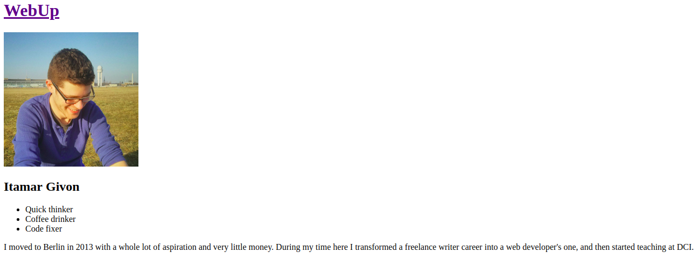

# Team Website

## Exercise I

- [x] Create an empty html file in the `team` folder. The file should be named as such `<your_name>.html` (replace `<your_name>` with your actual name i.e. for itamar it would be `itamar.html`).
- [x] Add the basic html structure to the file. Add a `meta` tag the name `author` and set the content to your full name.
- [x] Change the title of the document in the title tag to `WebUp | <your_full_name>` (replace `<your_full_name>` with your actual name i.e. for itamar it would be `WebUp | Itamar Givon`)
- [x] Make sure to link `styles/main.css` at the head of your document.

---

## Exercise II

- [x] Add a main heading to the page with the text "WebUp" at the top of the page.
- [x] Add your picture to the `img` folder. The picture should be cropped so its width and height are exactly the same.
- [x] Underneath the main heading, add your image to the page. The fallback text and hover tooltip for your image should have your full name. The image should be exactly 250 by 250 pixels and the image should have the class `profile-pic`.
- [x] Add a secondary heading with your name underneath your image the heading should have the class `profile-name`.
- [x] Below the heading, add an unordered list with three **_adjectives_** or **_phrases_** that describe you.
- [x] Finally, add a short paragraph or paragraphs to tell the world a little bit about yourself.

---

## Exercise III

- [x] In the document you just created, add a link to the main heading, so that when it is clicked, the browser will direct the user to the main page of the site (`index.html`)
- [x] In `index.html`, Add a smaller version of your picture (50x50 px exactly) and your name to the list under the title "Meet the team"
- [x] Link the image and your name to your personal page (with two separate links).

---
### Homepage

### Profile

